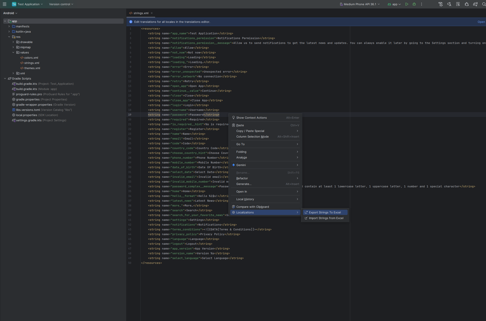
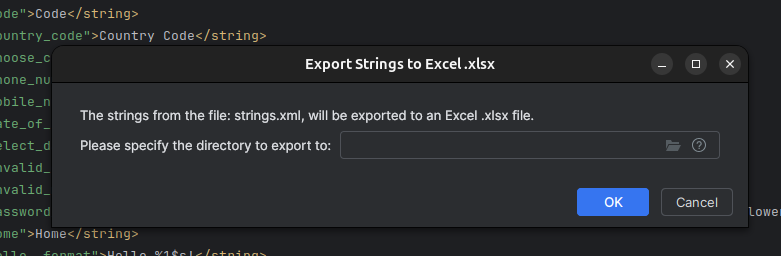
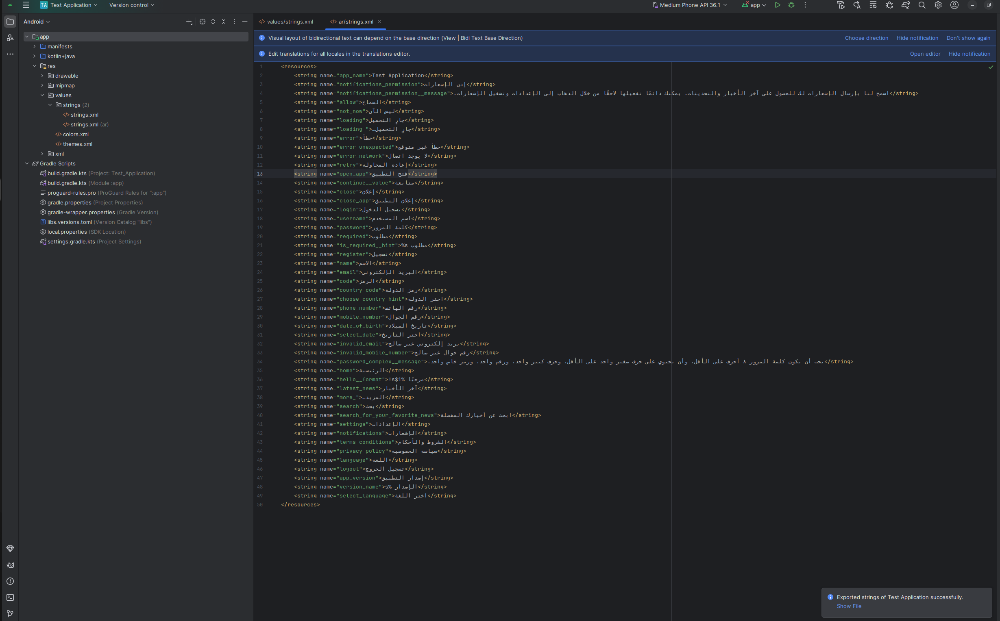
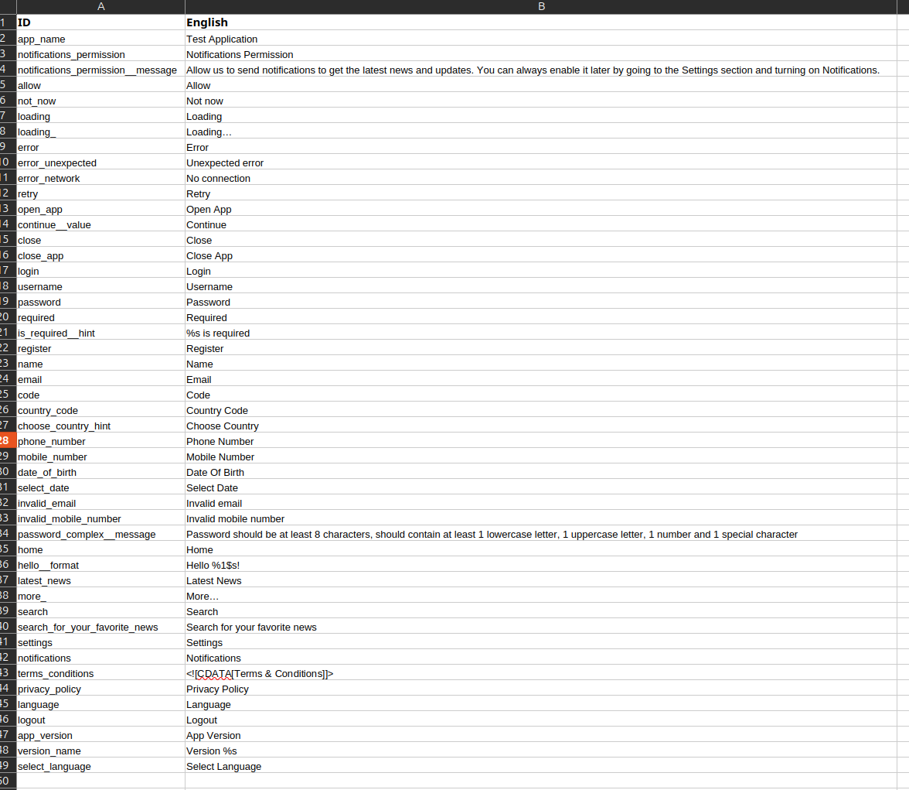
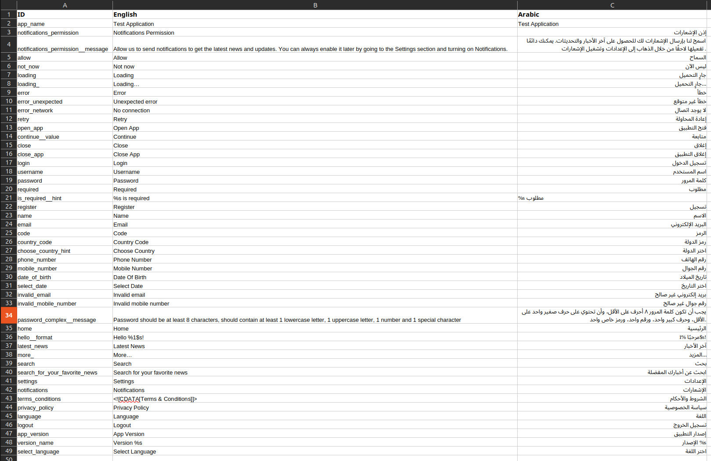
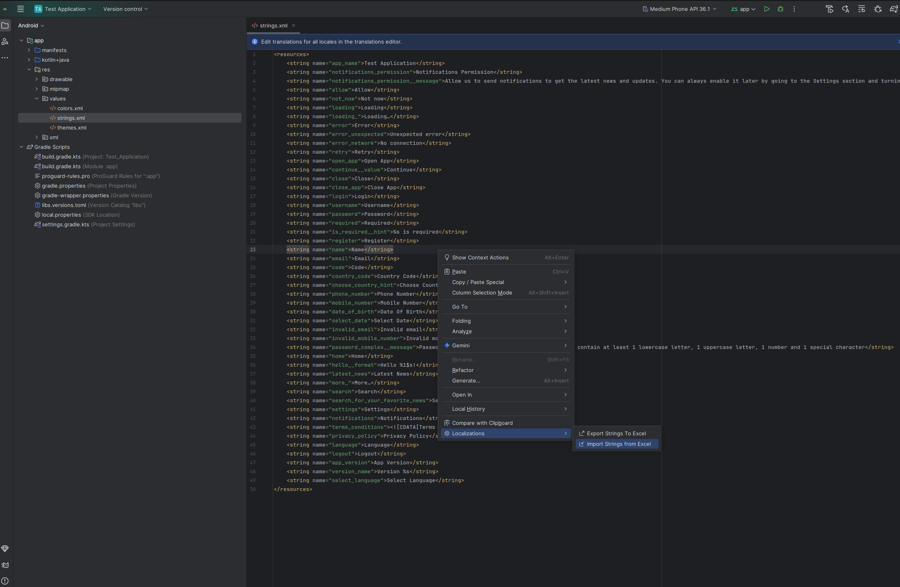
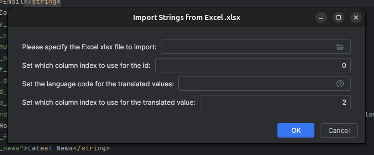
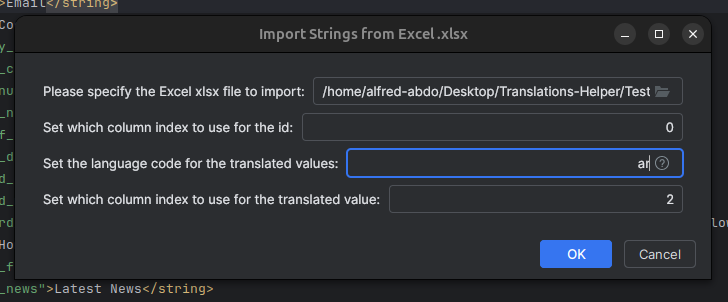
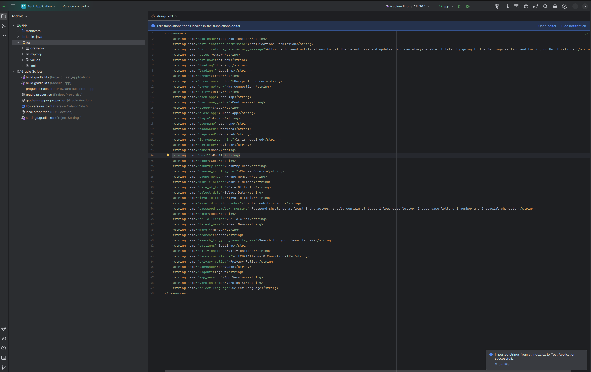
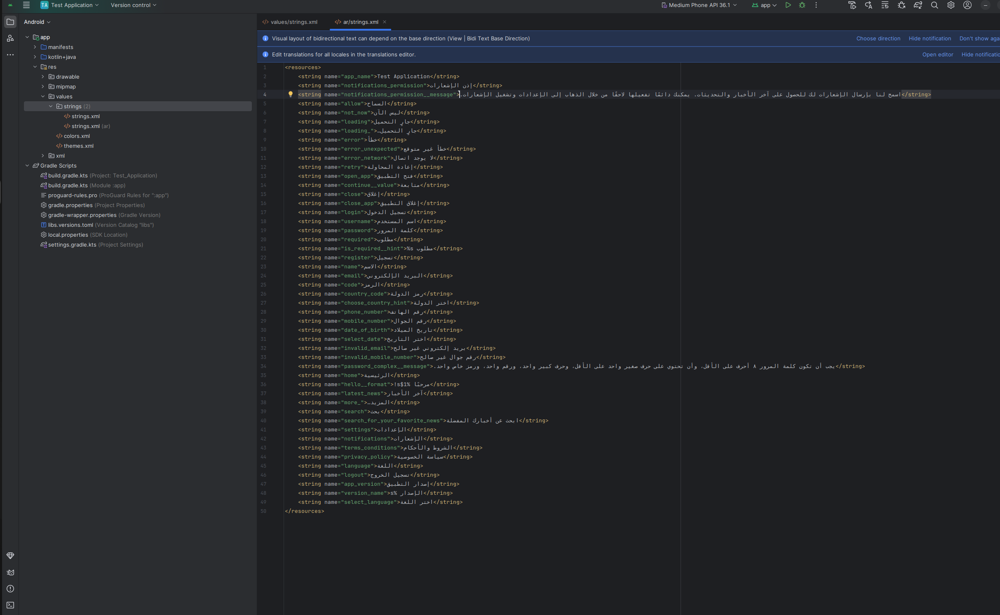

# Why should I use this?

This plugin allows developers to export the strings assets to be localized, that can be reimported when the localization
is done. If you missed the ability to be able to select all strings from Android Studio's translations editor, welcome.

# I want to use it

## Jetbrains Marketplace

The plugin is currently available in Jetbrains Marketplace in the _alpha_ channel (repo: https://plugins.jetbrains.com/plugins/alpha/list).
It should be promoted to the release channel once it is considered stable.

## GitHub Releases

The published plugin is also available in GitHub Releases.

# How do I use it?

## Export Strings to Excel

Right-click inside the strings.xml file (most probably the default one) -> Localizations -> Export Strings to Excel.

Choose the directory where you want to export the Excel xlsx file to (if left empty, it points to the default directory specified in
settings, you can hover over the help icon to see what the default directory will be).

Once you press __OK__, a strings.xlsx file will be created in the specified directory, and in the success notification you can click on
__Show File__ to go to it.

Below is the resulting Excel xlsx file:

## Import Strings from Excel

First make sure your Excel .xlsx file would contain the needed localizations in a new column (the title does not matter):

_N.B: Make sure the values in the file don't contain extra lines, or you will need to fix the values after exporting_

Right-click inside the default strings.xml or inside the target strings.xml -> Localizations -> Import Strings from Excel.

- Specify the input Excel xlsx
- Set which column will have the ids of the strings ("name")
- Set the language code for the translated strings (or keep empty to import inside the opened strings.xml file)
- Set which column will have the translated values

Below is an example:

Once you press __OK__, the strings.xml file will be created (or the targeted file will be filled, depending on the selection above), and in
the success notification you can click on __Show File__ to go to it.

_P.S: This example used ChatGPT to translate the strings in order to generate the images needed for this README file, hence the inaccurate
translations. In a real scenario, the translations should be checked by a translator when filling the Excel file._