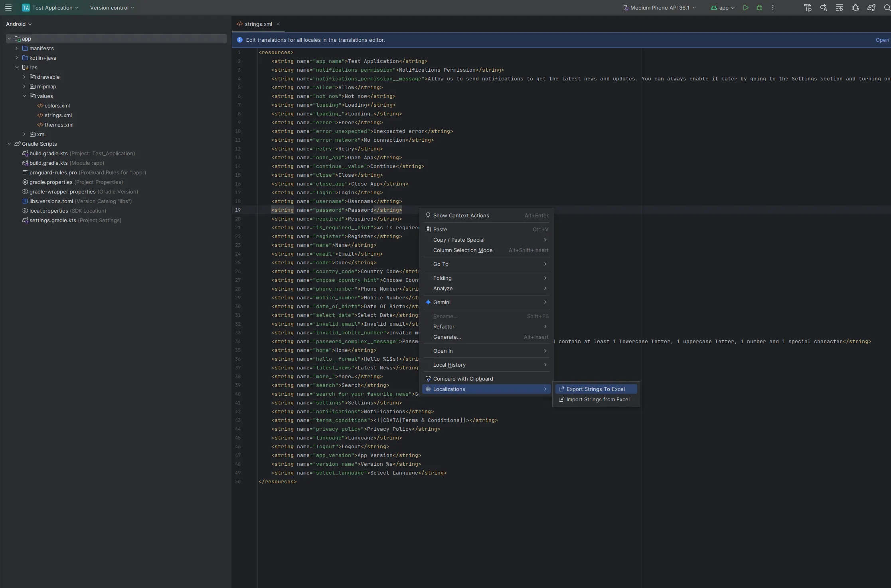
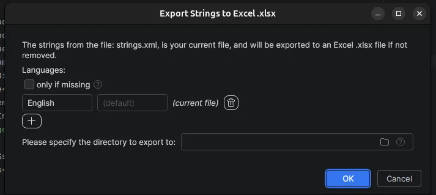
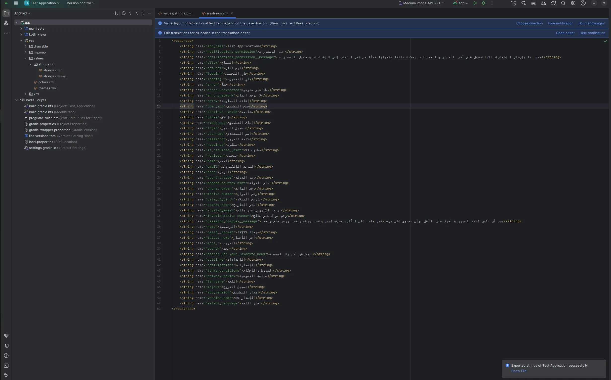
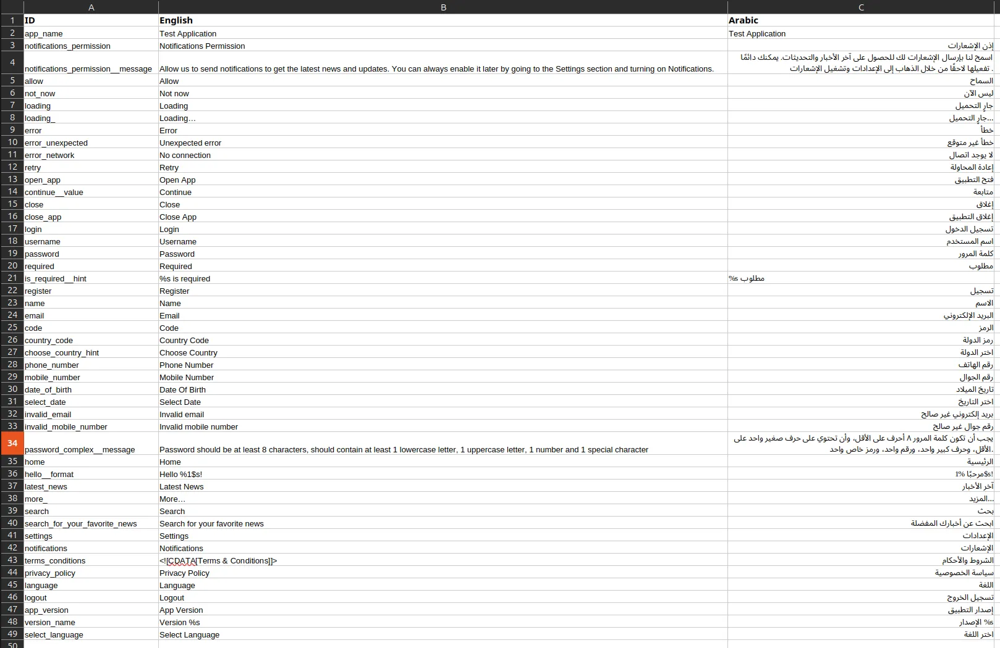
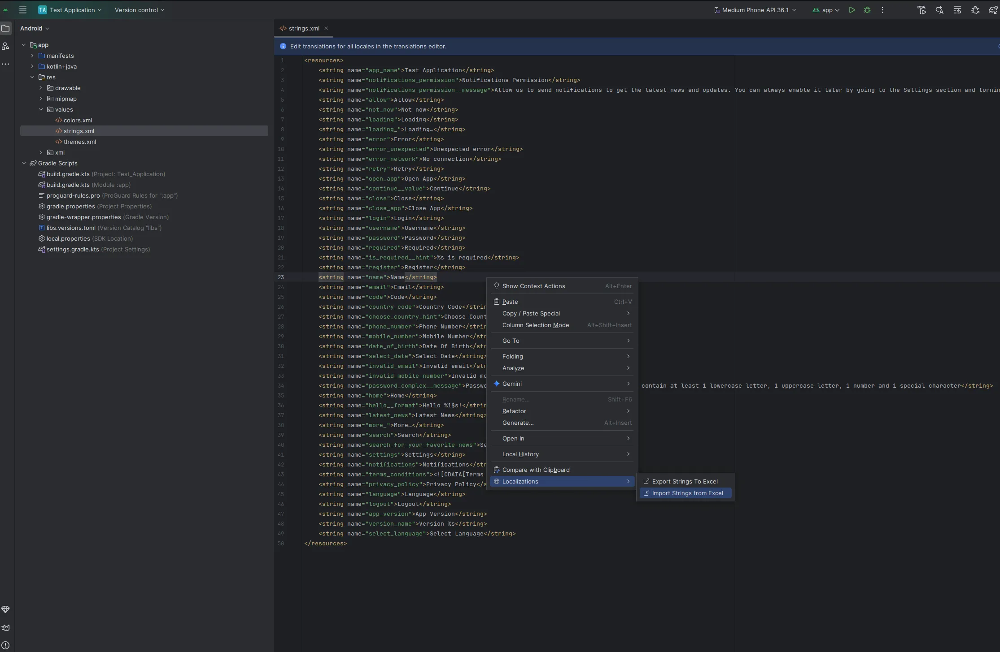
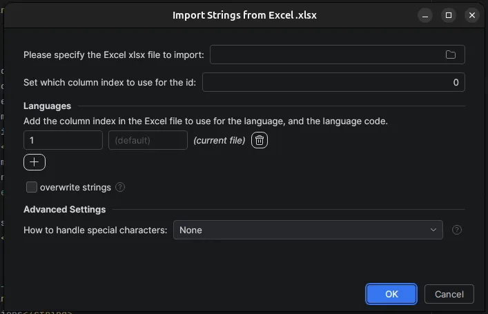
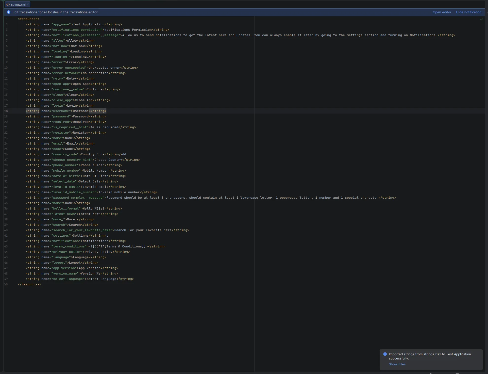
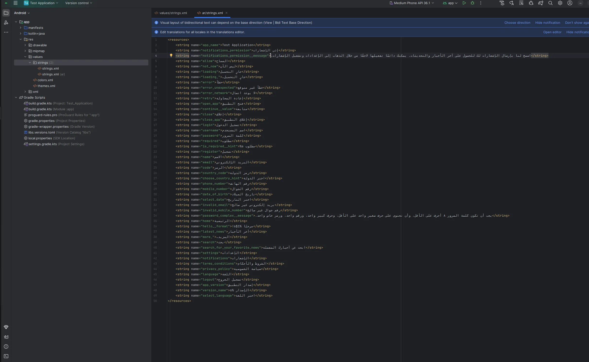

# Why should I use this?

This plugin allows developers to export the strings assets to be localized, that can be reimported when the localization
is done. If you missed the ability to be able to select all strings from Android Studio's translations editor, welcome.

# I want to use it

## JetBrains Marketplace

The plugin is currently available in Jetbrains Marketplace in the _alpha_ channel (repo: https://plugins.jetbrains.com/plugins/alpha/list).
It should be promoted to the release channel once it is considered stable.

## GitHub Releases

The published plugin is also available in GitHub Releases.

# How do I use it?

## Export Strings to Excel

Right-click inside the strings.xml file (most probably the default one) → Localizations → Export Strings to Excel.

- Add the languages you want to export from:
    - By default, the currently opened file is added as a language (the code is automatically detected and unmodifiable).
    - You can add a language by adding the label that will be shown in the Excel file for the related column (for e.g. "English"), and the
      language code you want to pull the strings from (for e.g. "ar").
    - Note that you can change the label of the first entry (the currently opened file).
    - Note that if you want to get the strings from the default file (the one inside the "values" folder, that does not have a language
      code), write "(default)" (without the quotes) for the code.
- Check "only if missing" if you only want to export the strings that are not translated into all the languages added.
- Choose the directory where you want to export the Excel xlsx file to.
    - If left empty, it points to the default directory specified in settings, you can hover over the help icon to see what the default
      directory will be.

Once you press __OK__, a strings.xlsx file will be created in the specified directory, and in the success notification you can click on
__Show File__ to go to it.

Below is the resulting Excel xlsx file:

## Import Strings from Excel

First make sure your Excel .xlsx file would contain the needed localizations in a new column (the title does not matter):

_N.B: Make sure the values in the file don't contain extra lines, or you will need to fix the values after exporting_

Right-click inside the default strings.xml or inside the target strings.xml → Localizations → Import Strings from Excel.

- Specify the input Excel xlsx
- Set which column will have the ids of the strings ("name")
- Add the languages you want to export to:
    - By default, the currently opened file is added as a language (the code is automatically detected and unmodifiable), and is assumed to
      be the 2nd column (index 1).
    - You can add a language by adding the column index to read the strings from (zero-based index, so 0 is the first column), and the
      language code you want to put the strings into (for e.g. "ar" will look for the file inside "values-ar").
    - Note that you can change the column index of the first entry (the currently opened file).
    - Note that if you want to put the strings into the default file (the one inside the "values" folder, that does not have a language
      code), write "(default)" (without the quotes) for the code.
- Check "overwrite strings" if you want to handle string conflicts (2 or more string resources having the same id, or "name" attribute) by
  updating the value instead of just adding the duplicate string resources.
    - Not checking it will allow you to resolve any conflicts yourself manually, so you can see which values you want to keep.
    - The update behavior also takes more time because each insertion will now need to check all the resources for conflicts.

Once you press __OK__, the strings.xml files will be created (the targeted file might be filled depending on if the _(current file)_
language) was kept, and in the success notification you can click on __Show Files__ to open them.

_P.S: This example used ChatGPT to translate the strings to fill the README file, because I needed a quick way to generate the screenshots,
hence the inaccurate translations. In a real world scenario, the translations should be checked by a translator when filling the Excel
file._